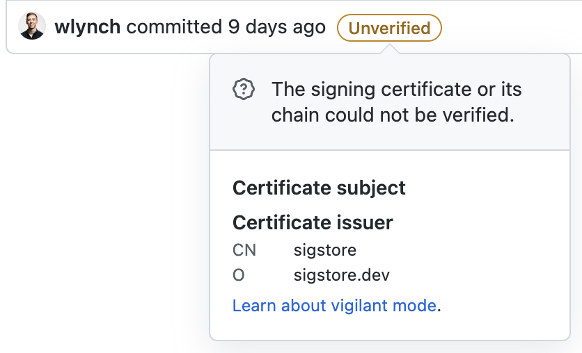

# Gitsign

[](https://github.com/sigstore/gitsign/actions/workflows/ci.yaml)
[](https://github.com/sigstore/gitsign/actions/workflows/e2e.yaml)

<p align="center">
  
</p>

Keyless Git signing with Sigstore!

This is heavily inspired by <https://github.com/github/smimesign>, but uses
keyless Sigstore to sign Git commits with your own GitHub / OIDC identity.

## Installation

Using Homebrew:

```sh
brew install sigstore/tap/gitsign
```

Using Go:

```sh
go install github.com/sigstore/gitsign@latest
```

## Configuration

Single Repository:

```sh
cd /path/to/my/repository
git config --local commit.gpgsign true  # Sign all commits
git config --local tag.gpgsign true  # Sign all tags
git config --local gpg.x509.program gitsign  # Use gitsign for signing
git config --local gpg.format x509  # gitsign expects x509 args
```

All respositories:

```sh
git config --global commit.gpgsign true  # Sign all commits
git config --global tag.gpgsign true  # Sign all tags
git config --global gpg.x509.program gitsign  # Use gitsign for signing
git config --global gpg.format x509  # gitsign expects x509 args
```

To learn more about these options, see
[`git-config`](https://git-scm.com/docs/git-config#Documentation/git-config.txt).

### File config

Gitsign can be configured with a standard
[git-config](https://git-scm.com/docs/git-config) file. For example, to set the
Fulcio option for a single repo:

```sh
$ git config --local gitsign.fulcio https://fulcio.example.com
```

The following config options are supported:

| Option             | Default                          | Description                                                                                                                                                                                                                                |
| ------------------ | -------------------------------- | ------------------------------------------------------------------------------------------------------------------------------------------------------------------------------------------------------------------------------------------ |
| fulcio             | https://fulcio.sigstore.dev      | Address of Fulcio server                                                                                                                                                                                                                   |
| logPath            |                                  | Path to log status output. Helpful for debugging when no TTY is available in the environment.                                                                                                                                              |
| clientID           | sigstore                         | OIDC client ID for application                                                                                                                                                                                                             |
| issuer             | https://oauth2.sigstore.dev/auth | OIDC provider to be used to issue ID token                                                                                                                                                                                                 |
| matchCommitter     | false                            | If true, verify that the committer matches certificate user identity. See [docs/committer-verification.md](./docs/committer-verification.md) for more details.                                                                             |
| redirectURL        |                                  | OIDC Redirect URL                                                                                                                                                                                                                          |
| rekor              | https://rekor.sigstore.dev       | Address of Rekor server                                                                                                                                                                                                                    |
| connectorID        |                                  | Optional Connector ID to auto-select to pre-select auth flow to use. For the public sigstore instance, valid values are:<br>- `https://github.com/login/oauth`<br>- `https://accounts.google.com`<br>- `https://login.microsoftonline.com` |
| timestampServerURL |                                  | Address of timestamping authority. If set, a trusted timestamp will be included in the signature.                                                                                                                                          |
| timestampCertChain |                                  | Path to PEM encoded certificate chain for RFC3161 Timestamp Authority verification.                                                                                                                                                        |

### Environment Variables

| Environment Variable         | Sigstore<br>Prefix | Default                          | Description                                                                                                                                                                                                                                                                                                                                                                                                           |
| ---------------------------- | ------------------ | -------------------------------- | --------------------------------------------------------------------------------------------------------------------------------------------------------------------------------------------------------------------------------------------------------------------------------------------------------------------------------------------------------------------------------------------------------------------- |
| GITSIGN_CREDENTIAL_CACHE     |                    |                                  | Optional path to [gitsign-credential-cache](cmd/gitsign-credential-cache/README.md) socket.                                                                                                                                                                                                                                                                                                                           |
| GITSIGN_CONNECTOR_ID         | ✅                 |                                  | Optional Connector ID to auto-select to pre-select auth flow to use. For the public sigstore instance, valid values are:<br>- `https://github.com/login/oauth`<br>- `https://accounts.google.com`<br>- `https://login.microsoftonline.com`                                                                                                                                                                            |
| GITSIGN_FULCIO_URL           | ✅                 | https://fulcio.sigstore.dev      | Address of Fulcio server                                                                                                                                                                                                                                                                                                                                                                                              |
| GITSIGN_LOG                  | ❌                 |                                  | Path to log status output. Helpful for debugging when no TTY is available in the environment.                                                                                                                                                                                                                                                                                                                         |
| GITSIGN_OIDC_CLIENT_ID       | ✅                 | sigstore                         | OIDC client ID for application                                                                                                                                                                                                                                                                                                                                                                                        |
| GITSIGN_OIDC_ISSUER          | ✅                 | https://oauth2.sigstore.dev/auth | OIDC provider to be used to issue ID token                                                                                                                                                                                                                                                                                                                                                                            |
| GITSIGN_OIDC_REDIRECT_URL    | ✅                 |                                  | OIDC Redirect URL                                                                                                                                                                                                                                                                                                                                                                                                     |
| GITSIGN_REKOR_URL            | ✅                 | https://rekor.sigstore.dev       | Address of Rekor server                                                                                                                                                                                                                                                                                                                                                                                               |
| GITSIGN_TIMESTAMP_SERVER_URL | ✅                 |                                  | Address of timestamping authority. If set, a trusted timestamp will be included in the signature.                                                                                                                                                                                                                                                                                                                     |
| GITSIGN_TIMESTAMP_CERT_CHAIN | ✅                 |                                  | Path to PEM encoded certificate chain for RFC3161 Timestamp Authority verification.                                                                                                                                                                                                                                                                                                                                   |
| GITSIGN_FULCIO_ROOT          | ✅                 |                                  | Path to PEM encoded certificate for Fulcio CA (additional alias: SIGSTORE_ROOT_FILE)                                                                                                                                                                                                                                                                                                                                  |
| GITSIGN_REKOR_MODE           | ❌                 | online                           | Rekor storage mode to operate in. One of [online, offline] (default: online)<br>online - Commit SHAs are stored in Rekor, requiring online verification for all commit objects.<br>offline - Hashed commit content is stored in Rekor, with Rekor attributes necessary for offline verification being stored in the commit itself.<br>Note: online verification will be deprecated in favor of offline in the future. |

For environment variables that support `Sigstore Prefix`, the values may be
provided with either a `GITSIGN_` or `SIGSTORE_` prefix - e.g.
`GITSIGN_CONNECTOR_ID` or `SIGSTORE_CONNECTOR_ID`. If both environment variables
are set, `GITSIGN_` prefix takes priority.

#### Other environment variables

| Environment Variable      | Description                                                                     |
| ------------------------- | ------------------------------------------------------------------------------- |
| SIGSTORE_REKOR_PUBLIC_KEY | This specifies an out of band PEM-encoded public key to use for a custom Rekor. |

## Usage

### Signing Commits

Once configured, you can sign commits as usual with `git commit -S` (or
`git config --global commit.gpgsign true` to enable signing for all commits).

```sh
$ git commit --allow-empty --message="Signed commit"
Your browser will now be opened to:
https://oauth2.sigstore.dev/auth/auth?access_type=online&client_id=sigstore&...
[main 040b9af] Signed commit
```

This will redirect you through the Sigstore Keyless flow to authenticate and
sign the commit.

### Signing Tags

Once configured, you can sign commits as usual with `git tag -s` (or
`git config --global tag.gpgsign true` to enable signing for all tags).

```sh
$ git tag v0.0.1
Your browser will now be opened to:
https://oauth2.sigstore.dev/auth/auth?access_type=online&client_id=sigstore&...
```

This will redirect you through the Sigstore Keyless flow to authenticate and
sign the tag.

### Verifying commits

Commits can be verified using `gitsign verify`:

```sh
$ gitsign verify --certificate-identity=billy@chainguard.dev --certificate-oidc-issuer=https://accounts.google.com HEAD
tlog index: 16072348
gitsign: Signature made using certificate ID 0xa6c178d9292f70eb5c4ad9e274ead0158e75e484 | CN=sigstore-intermediate,O=sigstore.dev
gitsign: Good signature from [billy@chainguard.dev](https://accounts.google.com)
Validated Git signature: true
Validated Rekor entry: true
Validated Certificate claims: true
```

`HEAD` may be replaced with any
[Git revision](https://git-scm.com/docs/gitrevisions) (e.g. branch, tag, etc.).

**NOTE**: `gitsign verify` is preferred over
[`git verify-commit`](https://git-scm.com/docs/git-verify-commit) and
[`git verify-tag`](https://git-scm.com/docs/git-verify-tag). The git commands
do not pass through any expected identity information to the signing tools, so
they only verify cryptographic integrity and that the data exists on Rekor, but
not **who** put the data there.

Using these commands will still work, but a warning being displayed.

```sh
$ git verify-commit HEAD
tlog index: 16072349
gitsign: Signature made using certificate ID 0xa6c178d9292f70eb5c4ad9e274ead0158e75e484 | CN=sigstore-intermediate,O=sigstore.dev
gitsign: Good signature from [billy@chainguard.dev](https://accounts.google.com)
Validated Git signature: true
Validated Rekor entry: true
Validated Certificate claims: false
WARNING: git verify-commit does not verify cert claims. Prefer using `gitsign verify` instead.
```

### Private Sigstore

Gitsign is compatible with other Sigstore tools cosign for running against other
Sigstore instances besides the default public instance. See
[cosign documentation](https://docs.sigstore.dev/cosign/custom_components/) for
how to configure and use another instance.

## FAQ

### Is there any way to bypass the browser flow?

A browser window is needed to get an OAuth token, since gitsign aims to not
store refresh tokens or other cryptographic material on disk, but there are some
things you can do to make this process a bit easier!

1. Set the `connectorID` config option - This preselects the identity provider
   to use. Assuming you're already signed in, in most cases you'll bounce
   directly to the auth success screen! (and you can clean up the browser tabs
   later)
2. Use the [Credential Cache](cmd/gitsign-credential-cache/README.md). This uses
   an in-memory credential cache over a file socket that allows you to persist
   keys and certificates for their full lifetime (meaning you only need to auth
   once every 10 minutes).

### Why doesn't GitHub show commits as [verified](https://docs.github.com/en/authentication/managing-commit-signature-verification/about-commit-signature-verification)?



GitHub doesn't recognize Gitsign signatures as verified at the moment:

1. The sigstore CA root is not a part of
   [GitHub's trust root](https://docs.github.com/en/authentication/managing-commit-signature-verification/about-commit-signature-verification#smime-commit-signature-verification).
2. Because Gitsign's ephemeral keys are only valid for a short time, using
   standard x509 verification would consider the certificate invalid after
   expiration. Verification needs to include validation via Rekor to verify the
   cert was valid at the time it was used.

We hope to work with GitHub to get these types of signatures recognized as
verified in the future!

## Debugging

### Configuration

If `gitsign` is running with unexpected configs, you can validate the config
values that are being ran by running `gitsign --version`:

```sh
$ gitsign --version
gitsign version v0.5.2
parsed config:
{
  "Fulcio": "https://fulcio.sigstore.dev",
  "FulcioRoot": "",
  "Rekor": "https://rekor.sigstore.dev",
  "ClientID": "sigstore",
  "RedirectURL": "",
  "Issuer": "https://oauth2.sigstore.dev/auth",
  "ConnectorID": "",
  "TimestampURL": "",
  "TimestampCert": "",
  "LogPath": ""
}
```

### Signing

If there is an error during signing, you may see an error like:

```
error: gpg failed to sign the data
fatal: failed to write commit object
```

When Git invokes signing tools, both stdout and stderr are captured which means
`gitsign` cannot push back messages to shells interactively. If a TTY is
available, `gitsign` will output information to the TTY output directly. If a
TTY is not available (e.g. in CI runners, etc.), you can use the `GITSIGN_LOG`
environment variable to tee logs into a readable location for debugging.

### Verification

- `failed to verify detached signature: x509: certificate signed by unknown authority`

  This usually means the TUF root used to verify the commit is not the same as
  the root that was used to sign it. This can happen if you use multiple
  sigstore instances frequently (e.g. if you're a sigstore developer - sigstore
  staging). You can double check relevant environment variables by running
  `gitsign --version`.

## Privacy

### What data does Gitsign store?

Gitsign stores data in 2 places:

1. Within the Git commit

   The commit itself contains a signed digest of the user commit content (e.g.
   author, committer, message, parents, etc.) along with the code signing
   certificate. This data is stored within the commit itself as part of your
   repository. See
   [Inspecting the Git commit signature](#inspecting-the-git-commit-signature)
   for more details.

2. Within the Rekor transparency log

   To be able to verify signatures for ephemeral certs past their `Not After`
   time, Gitsign records commits and the code signing certificates to
   [Rekor](https://docs.sigstore.dev/rekor/overview/).

   - If `rekorMode = online` (default)

   This data is a
   [HashedRekord](https://github.com/sigstore/rekor/blob/e375eb461cae524270889b57a249ff086bea6c05/types.md#hashed-rekord)
   containing a SHA256 hash of the commit SHA, as well as the code signing
   certificate. See
   [Verifying the Transparency Log](#verifying-the-transparency-log) for more
   details.

   - If `rekorMode = offline`

   Note: offline verification is new, and should be considered experimental for now.

   By default, data is written to the
   [public Rekor instance](https://docs.sigstore.dev/rekor/public-instance). In
   particular, users and organizations may be sensitive to the data contained
   within code signing certificates returned by Fulcio, which may include user
   emails or repo identifiers. See
   [OIDC usage in Fulcio](https://github.com/sigstore/fulcio/blob/6ac6b8c94c3ec6106d68c0f92225016a3a6eef79/docs/oidc.md)
   for more details for what data is contained in the code signing certs, and
   [Deploy a Rekor Server Manually](https://docs.sigstore.dev/rekor/installation/#deploy-a-rekor-server-manually)
   for how to run your own Rekor instance.

## Security

Should you discover any security issues, please refer to the
[security process](https://github.com/sigstore/gitsign/security/policy)

## Advanced

### Inspecting the Git commit signature

Git commit signatures use
[CMS/PKCS7 signatures](https://datatracker.ietf.org/doc/html/rfc5652). We can
inspect the underlying data / certificate used by running:

```sh
$ git cat-file commit HEAD | sed -n '/BEGIN/, /END/p' | sed 's/^ //g' | sed 's/gpgsig //g' | sed 's/SIGNED MESSAGE/PKCS7/g' | openssl pkcs7 -print -print_certs -text
PKCS7:
  type: pkcs7-signedData (1.2.840.113549.1.7.2)
  d.sign:
    version: 1
    md_algs:
        algorithm: sha256 (2.16.840.1.101.3.4.2.1)
        parameter: <ABSENT>
    contents:
      type: pkcs7-data (1.2.840.113549.1.7.1)
      d.data: <ABSENT>
    cert:
        cert_info:
          version: 2
          serialNumber: 0x2ECFB7E0D25F9A741FC3B19B56C4B74D25864788
          signature:
            algorithm: ecdsa-with-SHA384 (1.2.840.10045.4.3.3)
            parameter: <ABSENT>
          issuer: O=sigstore.dev, CN=sigstore-intermediate
          validity:
            notBefore: Jan 13 21:00:13 2023 GMT
            notAfter: Jan 13 21:10:13 2023 GMT
          subject:
          key:
            algor:
              algorithm: id-ecPublicKey (1.2.840.10045.2.1)
              parameter: OBJECT:prime256v1 (1.2.840.10045.3.1.7)
            public_key:  (0 unused bits)
              0000 - 04 0d 3e f5 05 98 53 d2-68 21 9d e7 88 07   ..>...S.h!....
              000e - 0a d9 bc 8e 9f e3 00 e0-5d 28 b2 41 24 a7   ........](.A$.
              001c - a5 93 28 cc 45 d9 1e ee-a3 1c 8d 42 64 ab   ..(.E......Bd.
              002a - 14 e6 ec 41 29 77 3a 0e-95 94 33 f7 40 62   ...A)w:...3.@b
              0038 - cd 25 fd 17 35 be 4d d4-f9                  .%..5.M..
          issuerUID: <ABSENT>
          subjectUID: <ABSENT>
          extensions:
              object: X509v3 Key Usage (2.5.29.15)
              critical: TRUE
              value:
                0000 - 03 02 07 80                              ....

              object: X509v3 Extended Key Usage (2.5.29.37)
              critical: BOOL ABSENT
              value:
                0000 - 30 0a 06 08 2b 06 01 05-05 07 03 03      0...+.......

              object: X509v3 Subject Key Identifier (2.5.29.14)
              critical: BOOL ABSENT
              value:
                0000 - 04 14 46 eb 25 b9 3b 3d-87 71 6a eb ba   ..F.%.;=.qj..
                000d - e4 a4 4b b0 f1 17 4b 46-58               ..K...KFX

              object: X509v3 Authority Key Identifier (2.5.29.35)
              critical: BOOL ABSENT
              value:
                0000 - 30 16 80 14 df d3 e9 cf-56 24 11 96 f9   0.......V$...
                000d - a8 d8 e9 28 55 a2 c6 2e-18 64 3f         ...(U....d?

              object: X509v3 Subject Alternative Name (2.5.29.17)
              critical: TRUE
              value:
                0000 - 30 16 81 14 62 69 6c 6c-79 40 63 68 61   0...billy@cha
                000d - 69 6e 67 75 61 72 64 2e-64 65 76         inguard.dev

              object: undefined (1.3.6.1.4.1.57264.1.1)
              critical: BOOL ABSENT
              value:
                0000 - 68 74 74 70 73 3a 2f 2f-61 63 63 6f 75   https://accou
                000d - 6e 74 73 2e 67 6f 6f 67-6c 65 2e 63 6f   nts.google.co
                001a - 6d                                       m

              object: undefined (1.3.6.1.4.1.11129.2.4.2)
              critical: BOOL ABSENT
              value:
                0000 - 04 7b 00 79 00 77 00 dd-3d 30 6a c6 c7   .{.y.w..=0j..
                000d - 11 32 63 19 1e 1c 99 67-37 02 a2 4a 5e   .2c....g7..J^
                001a - b8 de 3c ad ff 87 8a 72-80 2f 29 ee 8e   ..<....r./)..
                0027 - 00 00 01 85 ac ee dc fa-00 00 04 03 00   .............
                0034 - 48 30 46 02 21 00 a1 e2-05 30 53 6f fb   H0F.!....0So.
                0041 - 05 28 b6 bb 41 77 a9 7c-21 f4 a9 49 8b   .(..Aw.|!..I.
                004e - f8 a6 1f 35 85 a7 40 b3-07 5c cb 04 02   ...5..@..\...
                005b - 21 00 f4 39 7b 17 5a 59-fa 10 1c f8 bf   !..9{.ZY.....
                0068 - 46 cd bc de cc e8 39 7a-03 d4 1c 78 e5   F.....9z...x.
                0075 - b1 e7 7a ba 66 79 f2 c8-                 ..z.fy..
        sig_alg:
          algorithm: ecdsa-with-SHA384 (1.2.840.10045.4.3.3)
          parameter: <ABSENT>
        signature:  (0 unused bits)
          0000 - 30 65 02 30 5b 7c d7 ea-7c 5f 68 76 0b da 50   0e.0[|..|_hv..P
          000f - 14 cc bf 4c 65 07 70 68-52 33 9a 85 57 ce f5   ...Le.phR3..W..
          001e - ff 18 5b 8b 08 76 2a dd-7d 1a 19 7f b6 90 be   ..[..v*.}......
          002d - ad 24 96 9a 2a 0a d6 02-31 00 ac 15 2b 1d 00   .$..*...1...+..
          003c - 6e 26 95 66 c9 6d cd 7e-e0 cd 12 0e 60 8b f9   n&.f.m.~....`..
          004b - 38 a9 0a dc 01 28 9a 39-e3 cd c9 eb a5 0c 08   8....(.9.......
          005a - 71 47 39 c8 dc 9d db c3-cf 8e f5 cd e9         qG9..........
    crl:
      <EMPTY>
    signer_info:
        version: 1
        issuer_and_serial:
          issuer: O=sigstore.dev, CN=sigstore-intermediate
          serial: 0x2ECFB7E0D25F9A741FC3B19B56C4B74D25864788
        digest_alg:
          algorithm: sha256 (2.16.840.1.101.3.4.2.1)
          parameter: <ABSENT>
        auth_attr:
            object: contentType (1.2.840.113549.1.9.3)
            value.set:
              OBJECT:pkcs7-data (1.2.840.113549.1.7.1)

            object: signingTime (1.2.840.113549.1.9.5)
            value.set:
              UTCTIME:Jan 13 21:00:13 2023 GMT

            object: messageDigest (1.2.840.113549.1.9.4)
            value.set:
              OCTET STRING:
                0000 - 21 e9 ce 7a 69 ff 22 57-43 a2 fc c9 12   !..zi."WC....
                000d - 8a 67 c6 45 e7 31 88 4c-08 3f 26 9a 13   .g.E.1.L.?&..
                001a - ac 85 d6 6d f5 8e                        ...m..
        digest_enc_alg:
          algorithm: ecdsa-with-SHA256 (1.2.840.10045.4.3.2)
          parameter: <ABSENT>
        enc_digest:
          0000 - 30 46 02 21 00 cc 5a 1e-9a 27 70 ba 1f 70 7d   0F.!..Z..'p..p}
          000f - d6 f0 1c 56 f2 32 b3 d2-8f c4 63 dd 9c 82 cc   ...V.2....c....
          001e - 69 30 2c cd 9e 90 f9 02-21 00 82 43 0a f7 79   i0,.....!..C..y
          002d - 64 41 14 6b 28 03 ac 38-2b a3 82 bd a8 a1 ea   dA.k(..8+......
          003c - 52 db cf f2 5f d4 84 4f-85 b4 53 53            R..._..O..SS
        unauth_attr:
            object: undefined (1.3.6.1.4.1.57264.3.8)
            value.set:
              INTEGER:6954358

            object: undefined (1.3.6.1.4.1.57264.3.9)
            value.set:
              INTEGER:6954357

            object: undefined (1.3.6.1.4.1.57264.3.1)
            value.set:
              INTEGER:1673643613

            object: undefined (1.3.6.1.4.1.57264.3.3)
            value.set:
              INTEGER:11117788

            object: undefined (1.3.6.1.4.1.57264.3.2)
            value.set:
              PRINTABLESTRING:c0d23d6ad406973f9559f3ba2d1ca01f84147d8ffc5b8445c224f98b9591801d

            object: undefined (1.3.6.1.4.1.57264.3.7)
            value.set:
              PRINTABLESTRING:373443ac6ee5e01d4bfa00666f79d5c7cee0380684ebe571fc98bdffea82f972

            object: undefined (1.3.6.1.4.1.57264.3.4)
            value.set:
              OCTET STRING:
                0000 - 30 45 02 20 00 d0 88 ff-91 18 75 1c 90   0E. ......u..
                000d - 4c aa f3 37 94 45 a8 ca-1e a4 de 60 10   L..7.E.....`.
                001a - 0a 22 69 03 c9 2d d2 0e-1a 9f 02 21 00   ."i..-.....!.
                0027 - af cd 78 85 f2 66 5f 22-c5 d3 a2 5c fc   ..x..f_"...\.
                0034 - e2 c1 fe 0c f2 27 aa f0-fa fd 73 ca 5d   .....'....s.]
                0041 - 58 98 9c 00 df 5c                        X....\

            object: undefined (1.3.6.1.4.1.57264.3.5)
            value.set:
              UTF8STRING:rekor.sigstore.dev - 2605736670972794746
6954358
NzRDrG7l4B1L+gBmb3nVx87gOAaE6+Vx/Ji9/+qC+XI=
Timestamp: 1673643613823629328

\U2014 rekor.sigstore.dev wNI9ajBFAiB1IrUY3QV0nXQF0NFuo+1WtTRRYIKhaBI4rUj0Ry3WkwIhAI6D+kvZh+NhJ7Xi4HT0kPVB0nxGjR+cOHFOU1HJbUKF


            object: undefined (1.3.6.1.4.1.57264.3.6)
            value.set:
              SEQUENCE:
    0:d=0  hl=4 l= 858 cons: SEQUENCE
    4:d=1  hl=2 l=  64 prim:  PRINTABLESTRING   :be961775858a32f96c8d12fb8db3c3101bb4d8296f37f53f74dc2cb51c22a9ad
   70:d=1  hl=2 l=  64 prim:  PRINTABLESTRING   :92bd4aedddebab9be5678442a28bcfbada3300e04c0726368796a6d8b32fd909
  136:d=1  hl=2 l=  64 prim:  PRINTABLESTRING   :6e5a335c4b2f89e25d5be75ed0a724b154e0f53367bd4888c625d96f4a1e6b79
  202:d=1  hl=2 l=  64 prim:  PRINTABLESTRING   :67bce8699de01f6fc9ac8865ee5b08ee3a6617b57328b59cc342c55a4067652b
  268:d=1  hl=2 l=  64 prim:  PRINTABLESTRING   :f06fad8a06e8b60133ec7847be1586d517728f2da95f6e81ec9d1e4b1bbfc9d1
  334:d=1  hl=2 l=  64 prim:  PRINTABLESTRING   :32f164dcc4d2ff3b095c4f2d2b4beb25223cffd028a53fae3cac98f70e4bbd83
  400:d=1  hl=2 l=  64 prim:  PRINTABLESTRING   :1c3b03f4eff02f6405ef856350ffd03650d5de5271a65f0cee51ffe4fc6a99af
  466:d=1  hl=2 l=  64 prim:  PRINTABLESTRING   :c73ab44c0792697f44a5e237a47fff42f9c4dbf869071ee08e95dec222917f09
  532:d=1  hl=2 l=  64 prim:  PRINTABLESTRING   :e1e7772b7c20874ea1b3bebb2fd4ec5b496bcf45c338495ddbe93ae1fbcabe2c
  598:d=1  hl=2 l=  64 prim:  PRINTABLESTRING   :5da6951fe16688f8a256fc9adf3ccda1806b811e2bc50caab99ee61ded6ef6a3
  664:d=1  hl=2 l=  64 prim:  PRINTABLESTRING   :e7d67f5102ddeda58eda651dcba76876d01955a4eca9fce4caaf9e0ba7521cdd
  730:d=1  hl=2 l=  64 prim:  PRINTABLESTRING   :616429db6c7d20c5b0eff1a6e512ea57a0734b94ae0bc7c914679463e01a7fba
  796:d=1  hl=2 l=  64 prim:  PRINTABLESTRING   :5a4ad1534b1e770f02bfde0de15008a6971cf1ffbfa963fc9c2a644973a8d2d1
-----BEGIN PKCS7-----
MIIJ3gYJKoZIhvcNAQcCoIIJzzCCCcsCAQExDTALBglghkgBZQMEAgEwCwYJKoZI
hvcNAQcBoIICpTCCAqEwggInoAMCAQICFC7Pt+DSX5p0H8Oxm1bEt00lhkeIMAoG
CCqGSM49BAMDMDcxFTATBgNVBAoTDHNpZ3N0b3JlLmRldjEeMBwGA1UEAxMVc2ln
c3RvcmUtaW50ZXJtZWRpYXRlMB4XDTIzMDExMzIxMDAxM1oXDTIzMDExMzIxMTAx
M1owADBZMBMGByqGSM49AgEGCCqGSM49AwEHA0IABA0+9QWYU9JoIZ3niAcK2byO
n+MA4F0oskEkp6WTKMxF2R7uoxyNQmSrFObsQSl3Og6VlDP3QGLNJf0XNb5N1Pmj
ggFGMIIBQjAOBgNVHQ8BAf8EBAMCB4AwEwYDVR0lBAwwCgYIKwYBBQUHAwMwHQYD
VR0OBBYEFEbrJbk7PYdxauu65KRLsPEXS0ZYMB8GA1UdIwQYMBaAFN/T6c9WJBGW
+ajY6ShVosYuGGQ/MCIGA1UdEQEB/wQYMBaBFGJpbGx5QGNoYWluZ3VhcmQuZGV2
MCkGCisGAQQBg78wAQEEG2h0dHBzOi8vYWNjb3VudHMuZ29vZ2xlLmNvbTCBiwYK
KwYBBAHWeQIEAgR9BHsAeQB3AN09MGrGxxEyYxkeHJlnNwKiSl643jyt/4eKcoAv
Ke6OAAABhazu3PoAAAQDAEgwRgIhAKHiBTBTb/sFKLa7QXepfCH0qUmL+KYfNYWn
QLMHXMsEAiEA9Dl7F1pZ+hAc+L9GzbzezOg5egPUHHjlsed6umZ58sgwCgYIKoZI
zj0EAwMDaAAwZQIwW3zX6nxfaHYL2lAUzL9MZQdwaFIzmoVXzvX/GFuLCHYq3X0a
GX+2kL6tJJaaKgrWAjEArBUrHQBuJpVmyW3NfuDNEg5gi/k4qQrcASiaOePNyeul
DAhxRznI3J3bw8+O9c3pMYIG/zCCBvsCAQEwTzA3MRUwEwYDVQQKEwxzaWdzdG9y
ZS5kZXYxHjAcBgNVBAMTFXNpZ3N0b3JlLWludGVybWVkaWF0ZQIULs+34NJfmnQf
w7GbVsS3TSWGR4gwCwYJYIZIAWUDBAIBoGkwGAYJKoZIhvcNAQkDMQsGCSqGSIb3
DQEHATAcBgkqhkiG9w0BCQUxDxcNMjMwMTEzMjEwMDEzWjAvBgkqhkiG9w0BCQQx
IgQgIenOemn/IldDovzJEopnxkXnMYhMCD8mmhOshdZt9Y4wCgYIKoZIzj0EAwIE
SDBGAiEAzFoemidwuh9wfdbwHFbyMrPSj8Rj3ZyCzGkwLM2ekPkCIQCCQwr3eWRB
FGsoA6w4K6OCvaih6lLbz/Jf1IRPhbRTU6GCBdUwEwYKKwYBBAGDvzADCDEFAgNq
HXYwEwYKKwYBBAGDvzADCTEFAgNqHXUwFAYKKwYBBAGDvzADATEGAgRjwcZdMBQG
CisGAQQBg78wAwMxBgIEAKmk3DBQBgorBgEEAYO/MAMCMUITQGMwZDIzZDZhZDQw
Njk3M2Y5NTU5ZjNiYTJkMWNhMDFmODQxNDdkOGZmYzViODQ0NWMyMjRmOThiOTU5
MTgwMWQwUAYKKwYBBAGDvzADBzFCE0AzNzM0NDNhYzZlZTVlMDFkNGJmYTAwNjY2
Zjc5ZDVjN2NlZTAzODA2ODRlYmU1NzFmYzk4YmRmZmVhODJmOTcyMFcGCisGAQQB
g78wAwQxSQRHMEUCIADQiP+RGHUckEyq8zeURajKHqTeYBAKImkDyS3SDhqfAiEA
r814hfJmXyLF06Jc/OLB/gzyJ6rw+v1zyl1YmJwA31wwggEMBgorBgEEAYO/MAMF
MYH9DIH6cmVrb3Iuc2lnc3RvcmUuZGV2IC0gMjYwNTczNjY3MDk3Mjc5NDc0Ngo2
OTU0MzU4Ck56UkRyRzdsNEIxTCtnQm1iM25WeDg3Z09BYUU2K1Z4L0ppOS8rcUMr
WEk9ClRpbWVzdGFtcDogMTY3MzY0MzYxMzgyMzYyOTMyOAoK4oCUIHJla29yLnNp
Z3N0b3JlLmRldiB3Tkk5YWpCRkFpQjFJclVZM1FWMG5YUUYwTkZ1bysxV3RUUlJZ
SUtoYUJJNHJVajBSeTNXa3dJaEFJNkQra3ZaaCtOaEo3WGk0SFQwa1BWQjBueEdq
UitjT0hGT1UxSEpiVUtGCjCCA24GCisGAQQBg78wAwYxggNeMIIDWhNAYmU5NjE3
NzU4NThhMzJmOTZjOGQxMmZiOGRiM2MzMTAxYmI0ZDgyOTZmMzdmNTNmNzRkYzJj
YjUxYzIyYTlhZBNAOTJiZDRhZWRkZGViYWI5YmU1Njc4NDQyYTI4YmNmYmFkYTMz
MDBlMDRjMDcyNjM2ODc5NmE2ZDhiMzJmZDkwORNANmU1YTMzNWM0YjJmODllMjVk
NWJlNzVlZDBhNzI0YjE1NGUwZjUzMzY3YmQ0ODg4YzYyNWQ5NmY0YTFlNmI3ORNA
NjdiY2U4Njk5ZGUwMWY2ZmM5YWM4ODY1ZWU1YjA4ZWUzYTY2MTdiNTczMjhiNTlj
YzM0MmM1NWE0MDY3NjUyYhNAZjA2ZmFkOGEwNmU4YjYwMTMzZWM3ODQ3YmUxNTg2
ZDUxNzcyOGYyZGE5NWY2ZTgxZWM5ZDFlNGIxYmJmYzlkMRNAMzJmMTY0ZGNjNGQy
ZmYzYjA5NWM0ZjJkMmI0YmViMjUyMjNjZmZkMDI4YTUzZmFlM2NhYzk4ZjcwZTRi
YmQ4MxNAMWMzYjAzZjRlZmYwMmY2NDA1ZWY4NTYzNTBmZmQwMzY1MGQ1ZGU1Mjcx
YTY1ZjBjZWU1MWZmZTRmYzZhOTlhZhNAYzczYWI0NGMwNzkyNjk3ZjQ0YTVlMjM3
YTQ3ZmZmNDJmOWM0ZGJmODY5MDcxZWUwOGU5NWRlYzIyMjkxN2YwORNAZTFlNzc3
MmI3YzIwODc0ZWExYjNiZWJiMmZkNGVjNWI0OTZiY2Y0NWMzMzg0OTVkZGJlOTNh
ZTFmYmNhYmUyYxNANWRhNjk1MWZlMTY2ODhmOGEyNTZmYzlhZGYzY2NkYTE4MDZi
ODExZTJiYzUwY2FhYjk5ZWU2MWRlZDZlZjZhMxNAZTdkNjdmNTEwMmRkZWRhNThl
ZGE2NTFkY2JhNzY4NzZkMDE5NTVhNGVjYTlmY2U0Y2FhZjllMGJhNzUyMWNkZBNA
NjE2NDI5ZGI2YzdkMjBjNWIwZWZmMWE2ZTUxMmVhNTdhMDczNGI5NGFlMGJjN2M5
MTQ2Nzk0NjNlMDFhN2ZiYRNANWE0YWQxNTM0YjFlNzcwZjAyYmZkZTBkZTE1MDA4
YTY5NzFjZjFmZmJmYTk2M2ZjOWMyYTY0NDk3M2E4ZDJkMQ==
-----END PKCS7-----
```
